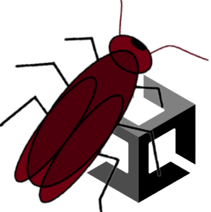

<h1>GazaStoryEditor</h1>

<h4>Unity可视化剧本编辑器</h4>

   

**Tips："Gaza"取自粤语“曱甴”，意思是蟑螂**

### 介绍

#### *DewityKit我还没有写完，写完之后会公开仓库。*

### 基于以下插件

开发框架：[DewityKit](https://github.com/DanKE123abc/DewityKit)

可视化工具：[xNode](https://github.com/Siccity/xNode)

编辑器扩展：[Odin](https://odininspector.com/)

